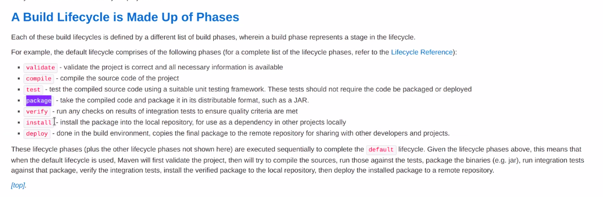
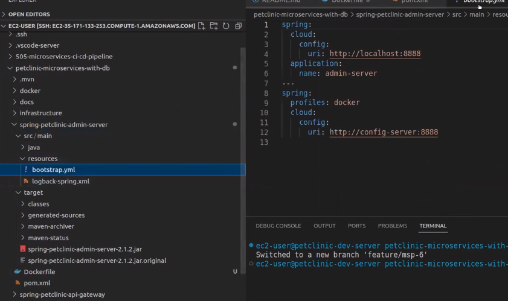

```Dockerfile
FROM alpine
ARG VERSION=1
#1 ADD https://github.com/james-clarusway/version-1/raw/main/version.tar /version.tar
#2 ADD https://github.com/james-clarusway/version-2/raw/main/version.tar /version.tar
ADD https://github.com/james-clarusway/version-${VERSION}/raw/main/version.tar version.tar
ENV KEY=value
# ENV newenvar=itisnew
RUN tar -xvf version.tar
CMD cat /version/version
# https://github.com/james-clarusway/version-1.git
```
- ADD komutu ile belititlen repodan version.tar dosyasını al.
- `RUN tar -xvf version.tar` .tar dosyasını aç.
- `CMD cat /version/version` bu satırda `cat` komutu ile dosyanın içini okuyor.
- `ARG` parametresi ile best parctise olarak hangi versionu build etmek istiyorsak komut satırına `docker buil --buil-arg VERSION=2 -t argtest4 .`  bu komutut gireriz.

```Dockerfile
FROM openjdk:11-jre
ARG DOCKERIZE_VERSION=v0.6.1
ARG EXPOSED_PORT=9090
ENV SPRING_PROFILES_ACTIVE docker,mysql
ADD https://github.com/jwilder/dockerize/releases/download/${DOCKERIZE_VERSION}/dockerize-alpine-linux-amd64-${DOCKERIZE_VERSION}.tar.gz dockerize.tar.gz
RUN tar -xzf dockerize.tar.gz
RUN chmod +x dockerize
ADD ./target/*.jar /app.jar
EXPOSE ${EXPOSED_PORT}
ENTRYPOINT ["java", "-Djava.security.egd=file:/dev/./urandom","-jar","/app.jar"]
```



- .jar file'ı `./mvn clean package` komut ile oluşturacağımız için `jre` kullandık. Eğer java kodu  geliştirecek isek `jdk`kullanılır.
- `ADD ./target/*.jar /app.jar` ---> `./mvn clean package` komutunu çalıştırdığım zaman `target` klasörü altında `.jar` file oluşacak. Yani kod bize `target` altındaki bütün `.jar` file'ları al ve containerin içine `app.jar` olarak kopyala diyor.


- `ADD` remotedan dosya alabiliyoruz ve `.jar` file açabiliyor.`COPY` bulunduğu klasörden açabiliyor. Yani Dockerfile'in bulunduğu klaördeki file açabiliyor.
- `SPRING_PROFILES_ACTIVE` is the environment variable to override/pick Spring profile. 



- Yani docker ortamını kullanacağım için `ENV SPRING_PROFILES_ACTIVE docker` ile docker'ı aktif ediyorum. O zaman localhosta gitmiyor `http://config-server:8888` gidiyor. Yani config-server'ın image na gidiyor.

```
ENTRYPOINT ile CMD ve shell ile exec arasındaki farkı exec-shell-CMD-ENTRYPOINT.md hands-on içinde
```
## Dockerfile dan Image oluşturmak


- Burada bir script yazıyoruz. `mvnw clean package` komutu ile oluşacak `.jar` file göre Dockerfile yazdığımız için scripti bununla başlattık.
- Bildiğimiz `docker build -t "tag_name" ./directory_name` komutu kullandık, ekstra olarak `--force-rm` kullanıldı.
- Docker build komutunu girdikten sonra herbir step için bir image oluşturuyor ve o image dan bir container oluşturuyor buna `ara container (intermediate containers)` denir. Bu şekilde gereksiz containerlar oluşur. Bu gereksiz yük bindiren containerlardan kurtulmak için `--force-rm` komutu kullanılır.
- `--force-rm` komutu Dockerfile da bir hata olsada bütün intermediate container ları siler ve output olarak hangi step de hata yapıldığını bize gösterir.


- Yukarıdaki fotoğrafta da `petclinic-microservices-with-db` directory'sinin içinde bulunan `build-dev-docker-images.sh` scripti bu directory'de bulunan `spring-petclinic-admin-server` klasöründeki `Dockerfile` çalıştır diyor.

## Docker Compose ile uygulamayı ayağa kaldıralım

```yaml
version: '2'

services: 
  config-server:
    image: petclinic-config-server:dev
    container_name: config-server
    mem_limit: 512M
    ports: 
      - 8888:8888

  discovery-server:
    image: petclinic-discovery-server:dev
    container_name: discovery-server
    mem_limit: 512M
    ports: 
      - 8761:8761
    depends_on: 
      - config-server
    entrypoint: ["./dockerize", "-wait=tcp://config-server:8888", "-timeout=160s", "--", "java", "-Djava.security.egd=file:/dev/./urandom","-jar","/app.jar"]

  customers-service:
    image: petclinic-customers-service:dev
    container_name: customers-service
    mem_limit: 512M
    ports:
     - 8081:8081
    depends_on: 
     - config-server
     - discovery-server
    entrypoint: ["./dockerize", "-wait=tcp://discovery-server:8761", "-timeout=160s", "--", "java", "-Djava.security.egd=file:/dev/./urandom","-jar","/app.jar" ]
  
  visits-service:
    image: petclinic-visits-service:dev
    container_name: visits-service
    mem_limit: 512M
    ports:
     - 8082:8082
    depends_on: 
     - config-server
     - discovery-server
    entrypoint: ["./dockerize", "-wait=tcp://discovery-server:8761", "-timeout=160s", "--", "java", "-Djava.security.egd=file:/dev/./urandom","-jar","/app.jar" ]
  
  vets-service:
    image: petclinic-vets-service:dev
    container_name: vets-service
    mem_limit: 512M
    ports:
     - 8083:8083
    depends_on: 
     - config-server
     - discovery-server
    entrypoint: ["./dockerize", "-wait=tcp://discovery-server:8761", "-timeout=160s", "--", "java", "-Djava.security.egd=file:/dev/./urandom","-jar","/app.jar" ]
  
  api-gateway:
    image: petclinic-api-gateway:dev
    container_name: api-gateway
    mem_limit: 512M
    ports:
     - 8080:8080
    depends_on: 
     - config-server
     - discovery-server
    entrypoint: ["./dockerize", "-wait=tcp://discovery-server:8761", "-timeout=160s", "--", "java", "-Djava.security.egd=file:/dev/./urandom","-jar","/app.jar" ]
  
  admin-server:
    image: petclinic-admin-server:dev
    container_name: admin-server
    mem_limit: 512M
    ports:
     - 9090:9090
    depends_on: 
     - config-server
     - discovery-server
    entrypoint: ["./dockerize", "-wait=tcp://discovery-server:8761", "-timeout=160s", "--", "java", "-Djava.security.egd=file:/dev/./urandom","-jar","/app.jar" ]

  hystrix-dashboard:
    image: petclinic-hystrix-dashboard:dev
    container_name: hystrix-dashboard
    mem_limit: 512M
    ports:
     - 7979:7979
    depends_on: 
     - config-server
     - discovery-server
    entrypoint: ["./dockerize", "-wait=tcp://discovery-server:8761", "-timeout=160s", "--", "java", "-Djava.security.egd=file:/dev/./urandom","-jar","/app.jar" ]

  tracing-server:
    image: openzipkin/zipkin
    container_name: tracing-server
    mem_limit: 512M
    environment:
    - JAVA_OPTS=-XX:+UnlockExperimentalVMOptions -Djava.security.egd=file:/dev/./urandom
    ports:
     - 9411:9411 
  
  grafana-server:
    image: petclinic-grafana-server:dev
    container_name: grafana-server
    mem_limit: 256M
    ports:
    - 3000:3000

  prometheus-server:
    image: petclinic-prometheus-server:dev
    container_name: prometheus-server
    mem_limit: 256M
    ports:
    - 9091:9090

  mysql-server:
    image: mysql:5.7.8
    container_name: mysql-server
    environment: 
      MYSQL_ROOT_PASSWORD: petclinic
      MYSQL_DATABASE: petclinic
    mem_limit: 256M
    ports:
    - 3306:3306
```


- Docker compose yazarken developer ile konuşulur ona göre yazılır, bu uygulamada yukarı daki resime göre de ilk olarak `config-server` sonra `discovery-server` ve diğerleri şeklinde oolduğu için `config-server` ile başlandı.

- Docker container a limit koymamız gerekir, yoksa bütün memoryi kullanır. Komut satırında memory'i belirtmek için `docker container run --memory 512M nginx` bu şekilde limiti aşmıyor.

- `version: '2'` olmasının sebebi belirtmiş olduğun `mem_limit`. Version 2 de kullanıldığından dolayı yazdık.


- Mesela `config-server` containerini ayağa kaldırmak için `docker run -p 8888:8888 --memorry 512M --name config-server petclinic-config-server:dev` şeklinde yazabilir, fakat digerleri içinde bunları girirmem gerekecek bu yüden `declative` olarak docker compose kullanıyoruz.


- Önce config-server kurulacak-çalışacak sonra discovery-server kurulup-çalışacak bunu `depends_on` ile sağlarız. 
- Config-serverin tam olarak hazır hale geldiğini kontrol etmemiz için `./dockerize` kullanılır.


