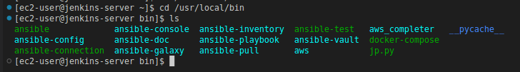
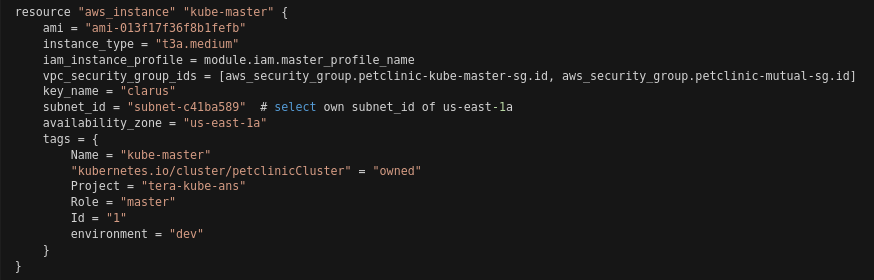

* Create a ``Jenkins Job`` to create Docker Registry for `dev` on AWS ECR manually.

```yml
- job name: create-ecr-docker-registry-for-dev
- job type: Freestyle project
- Build:
      Add build step: Execute Shell
      Command:
```

```bash
PATH="$PATH:/usr/local/bin"
APP_REPO_NAME="clarusway-repo/petclinic-app-dev"
AWS_REGION="us-east-1"

aws ecr describe-repositories --region ${AWS_REGION} --repository-name ${APP_REPO_NAME} || \
aws ecr create-repository \
--repository-name ${APP_REPO_NAME} \
--image-scanning-configuration scanOnPush=false \
--image-tag-mutability MUTABLE \
--region us-east-1
```

- `PATH="$PATH:/usr/local/bin"` Aws komutunun çalışacağı PATH'i gösteriyor.



- `APP_REPO_NAME` ECR reposuna isim verir.
- `image-scanning-configuration scanOnPush=false` image lardaki yazılım güvenlik açıkları tarıyor.
- `image-tag-mutability MUTABLE` gönderdiğimiz image'ların üzerine overwrite yapabiliriz.
- `||` komut satırındaki bu işaret soldaki komut çalışıyorsa sağdaki komutu çalıştırma demektir.

- After running the job above, replace the script with the one below in order to test creating key pair for `ansible`. (Click `Configure`)

```bash
PATH="$PATH:/usr/local/bin"
ANS_KEYPAIR="petclinic-ansible-test-dev.key"
AWS_REGION="us-east-1"
aws ec2 create-key-pair --region ${AWS_REGION} --key-name ${ANS_KEYPAIR} --query "KeyMaterial" --output text > ${ANS_KEYPAIR}
chmod 400 ${ANS_KEYPAIR}
```

- Burada key_pair oluşturuluyor.
- `aws ec2 create-key-pair --region ${AWS_REGION} --key-name ${ANS_KEYPAIR} --query "KeyMaterial" --output text > ${ANS_KEYPAIR}` belirtilen region'da key_pair oluştur ve `${ANS_KEYPAIR}` belirtilen isimde kaydet. Bu key_pair çalıştırdığımız jenkins jobının workspace'inde bulunur.
- `--query "KeyMaterial"` key_pairde bize lazım olan private kısmını bize getiriyor.

- After running the job above, replace the script with the one below in order to test creating kubernetes infrastructure with terraform. (Click `Configure`)

```bash
PATH="$PATH:/usr/local/bin"
ANS_KEYPAIR="petclinic-ansible-test-dev.key"
AWS_REGION="us-east-1"
cd infrastructure/dev-k8s-terraform
sed -i "s/clarus/$ANS_KEYPAIR/g" main.tf
terraform init
terraform apply -auto-approve -no-color
```

- İlk olarak dosyaları indirecek ve indirdiği dosyanın içine girecek `cd infrastructure/dev-k8s-terraform`

- `sed -i "s/clarus/$ANS_KEYPAIR/g" main.tf` `sed` editorü ile main.tf içinde `/g` main.tf içerinin tamamında `clarus` yazan kısım yerine `$ANS_KEYPAIR` değişkeninin yaz ve bu şekilde kaydet.

```bash
ANS_KEYPAIR="petclinic-ansible-test-dev.key"
ssh -o UserKnownHostsFile=/dev/null -o StrictHostKeyChecking=no -i ${WORKSPACE}/${ANS_KEYPAIR} ubuntu@172.31.91.243 hostname
```
- ssh komutu ile makineye bağlanıyoruz. `ssh -i ${WORKSPACE}/${ANS_KEYPAIR} ubuntu@172.31.91.243 hostname` ssh ile makineye bağlanma komutudur.
- `${WORKSPACE}/${ANS_KEYPAIR} ubuntu@172.31.91.243` makineyi tanımlıyoruz. Çalıştığımız Workspacedeki key_pairi alıyor.
      
- `${WORKSPACE}` jenkins'de tanımlı değişkendeki `/${ANS_KEYPAIR}` tanımlı key_pairi buluyor

- `-o StrictHostKeyChecking=no` makineye bağlanırken onay olarak `yes` girilen onayı istemiyoruz. Otomatik birşekilde bağlansın.
- `-o UserKnownHostsFile=/dev/null` girdiğim private ip'yi  `known_hosts` klasörünün içine atıyor fakat biz `/dev/null` kaydetme diyoruz.


- `known_hosts` klasörünün içinde kaydedince belli bir süre sonra hata verebilir diye buraya kaydetmiyoruz.

- `hostname` komut makineye bağlandığında girdiğimiz ip adresini gösterir.


- Prepare static inventory file with name of `hosts.ini` for Ansible under `ansible/inventory` folder using Docker machines private IP addresses.

```ini
172.31.91.243   ansible_user=ubuntu  
172.31.87.143   ansible_user=ubuntu
172.31.90.30    ansible_user=ubuntu
```

- Commit the change, then push to the remote repo.

```bash
git add .
git commit -m 'added ansible static inventory host.ini for testing'
git push --set-upstream origin feature/msp-16
```

- Configure `test-creating-qa-automation-infrastructure` job and replace the existing script with the one below in order to test ansible by pinging static hosts.

```bash
PATH="$PATH:/usr/local/bin"
ANS_KEYPAIR="petclinic-ansible-test-dev.key"
export ANSIBLE_INVENTORY="${WORKSPACE}/ansible/inventory/hosts.ini"
export ANSIBLE_PRIVATE_KEY_FILE="${WORKSPACE}/${ANS_KEYPAIR}"
export ANSIBLE_HOST_KEY_CHECKING=False
ansible all -m ping
```
- `export ANSIBLE_INVENTORY="${WORKSPACE}/ansible/inventory/hosts.ini"` ansible inventory dosyasını nereden alacağını adresledik ve bu dosyayı kulan diyoruz.

- `export ANSIBLE_PRIVATE_KEY_FILE="${WORKSPACE}/${ANS_KEYPAIR}"` tanımladığımız key_pairi kullan diyor.

- `export ANSIBLE_HOST_KEY_CHECKING=False` ping atarken bizden onay istemesin.

- Bu pipeline çalıştığında aşağıdaki hata yı alır.


- warningi gidermek için


```bash
PATH="$PATH:/usr/local/bin"
ANS_KEYPAIR="petclinic-ansible-test-dev.key"
export ANSIBLE_INVENTORY="${WORKSPACE}/ansible/inventory/hosts.ini"
export ANSIBLE_PRIVATE_KEY_FILE="${WORKSPACE}/${ANS_KEYPAIR}"
export ANSIBLE_HOST_KEY_CHECKING=False
export ANSIBLE_DEPRECATION_WARNINGS=False
ansible all -m ping
```

- Prepare dynamic inventory file with name of `dev_stack_dynamic_inventory_aws_ec2.yaml` for Ansible under `ansible/inventory` folder using ec2 instances private IP addresses.

```yaml
plugin: aws_ec2
regions:
  - "us-east-1"
filters:
  tag:Project: tera-kube-ans
  tag:environment: dev
  instance-state-name: running
keyed_groups:
  - key: tags['Project']
    prefix: 'all_instances'
  - key: tags['Role']
    prefix: 'role'
hostnames:
  - "ip-address"
compose:
  ansible_user: "'ubuntu'"
```
- Dynamic_inventory aws_ec2 plugini ile dinamik olarak bütün makinelerimizin bilgilerini görmemizi sağlıyor.

- Filterları kubernetes kurarken verdiğimiz tag lere göre veriyoruz.



- `hostnames:` inventoryi getirirken `ip address` ile getir diyor.

- `compose` playbook çalışırken hangi user olarak çalıştığını belirtiğimiz bir değişken tanımlıyor. Yani makinelerimiz `ubuntu` ise bunu tanımlıyoruz.


- Ansible playbook da işlem yapmak için dynamic inventory de gruplamak için `keyed_group` kullanılır.

- `keyed_group` dan sonra:


- `prefix` grubun başına rol ifadesi yazılıyor. Bu yoksa iki altçizgi oluyordu.

- Commit the change, then push the cloudformation template to the remote repo.

```bash
git add .
git commit -m 'added ansible dynamic inventory files for dev environment'
git push
```

- Configure `test-creating-qa-automation-infrastructure` job and replace the existing script with the one below in order to check the Ansible dynamic inventory for `dev` environment. (Click `Configure`)

```bash
APP_NAME="Petclinic"
ANS_KEYPAIR="petclinic-ansible-test-dev.key"
PATH="$PATH:/usr/local/bin"
export ANSIBLE_PRIVATE_KEY_FILE="${WORKSPACE}/${ANS_KEYPAIR}"
export ANSIBLE_HOST_KEY_CHECKING=False
ansible-inventory -v -i ./ansible/inventory/dev_stack_dynamic_inventory_aws_ec2.yaml --graph
```

- Dynamic inventory dosyamızın çalıştığını kotrol ediyoruz.
- `-i ./ansible/inventory/dev_stack_dynamic_inventory_aws_ec2.yaml` inventory dosyamızı tanımlıyoruz.

- `-v` verbosa yani hatanın ayrıntısını veriyor. `v` ler (-vvv) daha fazla olursa daha ayrıntılı bir şekilde hatayı gösteriyor.

- `--graph` listeleme işlemi yapıyor.

- After running the job above, replace the script with the one below in order to test all instances within dev dynamic inventory by pinging static hosts. (Click `Configure`)

```bash
# Test dev dynamic inventory by pinging
APP_NAME="Petclinic"
ANS_KEYPAIR="petclinic-ansible-test-dev.key"
PATH="$PATH:/usr/local/bin"
export ANSIBLE_PRIVATE_KEY_FILE="${WORKSPACE}/${ANS_KEYPAIR}"
export ANSIBLE_HOST_KEY_CHECKING=False
ansible -i ./ansible/inventory/dev_stack_dynamic_inventory_aws_ec2.yaml all -m ping
```

- Dynamic inventory ile makinelere ping atıyoruz.

- Ansible ile playbookumuzu yazmaya başlayacağız. StorageClass dosyası clusterlarımızda storageclass oluşturmamızı sağlıyor. Diğeri config dosyasıdır.

- Terraform dosyası ile kurmuş olduğumuz kubernetese ansible ile cluster oluşturacağız. Bunu kubeadm ile kuracağız.

- Kubernetes hands-on1 in ansible ile kurulumu

- Create a `ClusterConfiguration file` and save it as `clusterconfig-base.yml` under `ansible/playbooks` folder.

```yml
---
apiVersion: kubeadm.k8s.io/v1beta3
kind: ClusterConfiguration
kubernetesVersion: v1.23.5
controlPlaneEndpoint: ${CONTROLPLANE_ENDPOINT}
networking:
  podSubnet: 10.244.0.0/16
apiServer:
  extraArgs:
    cloud-provider: external
    enable-aggregator-routing: "true"
controllerManager:
  extraArgs:
    cloud-provider: external
---
apiVersion: kubeadm.k8s.io/v1beta3
kind: InitConfiguration
nodeRegistration:
  kubeletExtraArgs:
    cloud-provider: external
---
kind: KubeletConfiguration
apiVersion: kubelet.config.k8s.io/v1beta1
cgroupDriver: systemd
```

- The fields in the `clusterconfig-base.yml` file:

  - ``controlePlaneEndpoint:`` Private IP address of the master node. (It will be paste programmatically.)
  - ``podSubnet:`` Pod CIDR is necessary for Flannel CNI Plug-in.

- `controlPlaneEndpoint: ${CONTROLPLANE_ENDPOINT}` master makinein private ip sini almamız lazım.

- `podSubnet: 10.244.0.0/16` bu cidr block dan ip atasın.

- `cloud-provider: external` cloud-providerı harici kullanacağız. Bunu aws in volume için ebs, ingress için loadbalancer kullanmak için 

- `enable-aggregator-routing: "true"` birden fazla master makineler için kullanılan parametredir.

  - `true` api-server lar için gelen trafiği topluyor.

- `controllerManager:` `cloud-provider: external` makineye kendini `external` a göre ayarla ve hangi resource istiyorsa o resource ver.

- `nodeRegistration:` Yeni node lar eklenebilir bunun için girilmesi gereken ekstra özellikler girilir

- `cgroupDriver: systemd` kubelet in daha stabil çalışması için kullanılır.

- Create a yaml file for Kubernetes `StorageClass` object and name it as `storage.yml` under `ansible/playbooks` folder.

```yaml
kind: StorageClass
apiVersion: storage.k8s.io/v1
metadata:
  name: ebs-sc
provisioner: ebs.csi.aws.com
volumeBindingMode: WaitForFirstConsumer
parameters:
  csi.storage.k8s.io/fstype: xfs
  type: io1
  iopsPerGB: "50"
  encrypted: "true"
allowedTopologies:
- matchLabelExpressions:
  - key: topology.ebs.csi.aws.com/zone
    values:
    - us-east-1a
```

- `StorageClass` in amacı dinamik bir şekilde volume oluşturmak. Dİnamik olmasaydı önce persistent-volume sonra presistent-volume-claim oluşturup bağlayacaktık.

- `provisioner: ebs.csi.aws.com` aws ebs de bize storage oluşturmamizı sağlıyor. Bunu driver ni ansible-playbookunda indireceğiz.

- `volumeBindingMode: WaitForFirstConsumer` ekstra maliyetin önüne geçmek için pod oluştuğunda claim ediyor.

- `allowedTopologies:` bölgesel tanımlama yapmak için
  - Makinemiz `us-east-1`da kurulduğundan ve maliyetin artmasını engellemek için `us-east-1a` de volume oluştur diyoruz.


- Create an ansible playbook to install kubernetes and save it as `k8s_setup.yaml` under `ansible/playbooks` folder.

```yaml
---
- hosts: all
  become: true
  tasks:

  - name: change hostnames
    shell: "hostnamectl set-hostname {{ hostvars[inventory_hostname]['private_dns_name'] }}"

  - name: swap off
    shell: |
      free -m
      swapoff -a && sed -i '/ swap / s/^/#/' /etc/fstab

  - name: Enable the nodes to see bridged traffic
    shell: |
      cat << EOF | sudo tee /etc/sysctl.d/k8s.conf
      net.bridge.bridge-nf-call-ip6tables = 1
      net.bridge.bridge-nf-call-iptables = 1
      EOF
      sysctl --system

  - name: update apt-get
    shell: apt-get update

  - name: Install packages that allow apt to be used over HTTPS
    apt:
      name: "{{ packages }}"
      state: present
      update_cache: yes
    vars:
      packages:
      - apt-transport-https  
      - curl
      - ca-certificates

  - name: update apt-get and install kube packages
    shell: |
      curl -s https://packages.cloud.google.com/apt/doc/apt-key.gpg | sudo apt-key add - && \
      echo "deb http://apt.kubernetes.io/ kubernetes-xenial main" | sudo tee /etc/apt/sources.list.d/kubernetes.list && \
      apt-get update -q && \
      apt-get install -qy kubelet=1.23.5-00 kubectl=1.23.5-00 kubeadm=1.23.5-00 docker.io

  - name: Add ubuntu to docker group
    user:
      name: ubuntu
      group: docker

  - name: Restart docker and enable
    service:
      name: docker
      state: restarted
      enabled: yes

  # change the Docker cgroup driver by creating a configuration file `/etc/docker/daemon.json` 
  # and adding the following line then restart deamon, docker and kubelet

  - name: change the Docker cgroup
    shell: |
      echo '{"exec-opts": ["native.cgroupdriver=systemd"]}' | sudo tee /etc/docker/daemon.json
      sudo systemctl daemon-reload
      sudo systemctl restart docker
      sudo systemctl restart kubelet


- hosts: role_master
  tasks:
    
  - name: pull kubernetes images before installation
    become: yes
    shell: kubeadm config images pull

  - name: copy the configuration
    become: yes
    copy: 
      src: ./clusterconfig-base.yml
      dest: /home/ubuntu/
  
  - name: get gettext-base
    become: true
    apt:
      package: gettext-base
      state: present

  - name: change controlplane_endpoint and produce the clusterconfig.yml file
    shell: |
      export CONTROLPLANE_ENDPOINT={{ hostvars[inventory_hostname]['private_ip_address'] }}
      envsubst < /home/ubuntu/clusterconfig-base.yml > /home/ubuntu/clusterconfig.yml

  - name: initialize the Kubernetes cluster using kubeadm
    become: true
    shell: |
      kubeadm init --config /home/ubuntu/clusterconfig.yml
  
  - name: Setup kubeconfig for ubuntu user
    become: true
    command: "{{ item }}"
    with_items:
     - mkdir -p /home/ubuntu/.kube
     - cp -i /etc/kubernetes/admin.conf /home/ubuntu/.kube/config
     - chown ubuntu:ubuntu /home/ubuntu/.kube/config

  - name: Install flannel pod network
    shell: kubectl apply -f https://github.com/coreos/flannel/raw/master/Documentation/kube-flannel.yml

  - name: Generate join command
    become: true
    command: kubeadm token create --print-join-command
    register: join_command_for_workers

  - debug: msg='{{ join_command_for_workers.stdout.strip() }}'

  - name: register join command for workers
    add_host:
      name: "kube_master"
      worker_join: "{{ join_command_for_workers.stdout.strip() }}"

- hosts: role_worker
  become: true
  tasks:

  - name: Join workers to cluster
    shell: "{{ hostvars['kube_master']['worker_join'] }}"
    register: result_of_joining

- hosts: role_master
  become: false
  tasks:

  - name: Patch the instances
    become: false
    shell: |
      cd /home/ubuntu
      kubectl patch node {{ hostvars[groups['role_master'][0]]['private_dns_name'] }} -p '{"spec":{"providerID":"aws:///us-east-1a/{{ hostvars[groups['role_master'][0]]['instance_id'] }}" }}'
      kubectl patch node {{ hostvars[groups['role_worker'][0]]['private_dns_name'] }} -p '{"spec":{"providerID":"aws:///us-east-1a/{{ hostvars[groups['role_worker'][0]]['instance_id'] }}" }}'
      kubectl patch node {{ hostvars[groups['role_worker'][1]]['private_dns_name'] }} -p '{"spec":{"providerID":"aws:///us-east-1a/{{ hostvars[groups['role_worker'][1]]['instance_id'] }}" }}'

  - name: Deploy the required cloud-controller-manager 
    shell: |
      cd /home/ubuntu
      curl -fsSL -o get_helm.sh https://raw.githubusercontent.com/helm/helm/master/scripts/get-helm-3
      chmod 777 get_helm.sh
      ./get_helm.sh
      helm repo add aws-cloud-controller-manager https://kubernetes.github.io/cloud-provider-aws
      helm repo update
      helm upgrade --install aws-cloud-controller-manager aws-cloud-controller-manager/aws-cloud-controller-manager --set image.tag=v1.20.0-alpha.0
    
  - name: Deploy Nginx Ingress 
    shell: kubectl apply -f https://raw.githubusercontent.com/kubernetes/ingress-nginx/controller-v1.1.2/deploy/static/provider/aws/deploy.yaml

  - name: Deploy AWS CSI Driver
    become: false
    shell: kubectl apply -k "github.com/kubernetes-sigs/aws-ebs-csi-driver/deploy/kubernetes/overlays/stable"

  - name: copy the storage.yml file
    become: yes
    copy: 
      src: ./storage.yml
      dest: /home/ubuntu/

  - name: create StorageClass object
    become: false
    shell: kubectl apply -f storage.yml
```

- `name: change hostnames` makinelere hostname atıyoruz.
  - `"hostnamectl set-hostname {{ hostvars[inventory_hostname]['private_dns_name'] }}"` makineler daha oluşturulmadığı için bu şekilde yazıyoruz. `hostvars` ile `inventory_hostname` içindeki `private_dns_name` leri getir.
  - `hostvars` magic variables metadata içinden istenilen bilgileri getiriyor.

- `swap off` ram yetmez ise harddiski kullanıyor. Bunu önlemek için yapılır.

- kubelete `systemd` kullan demiştik, docker içinde aynısı yapılıyor. `name: change the Docker cgroup`

- `name: pull kubernetes images before installation` arkada sistemin çalışması için gerekli image ları indiriyor.


  - master makineye `./clusterconfig-base.yml` dosyasını gönder(kopyala).

  - `envsubst` komutunu kullanmak için `- name: get gettext-base` indiriyorum. Bu komut `envsubst` ubuntu makineler için kullanılan komuttur.

  - `export CONTROLPLANE_ENDPOINT={{ hostvars[inventory_hostname]['private_ip_address'] }}` masterin shellinde master makinenin private ip adresini shell de tanıtıyor. `export` o shell de değişkeni tanıtmış oluyoruz.

  - `envsubst < /home/ubuntu/clusterconfig-base.yml > /home/ubuntu/clusterconfig.yml` master makinenin içine gönderdiğimiz `clusterconfig-base.yml` dosyasını `clusterconfig.yml` olarak dosya oluştur ve artık `CONTROLPLANE_ENDPOINT` belli olduğu için dosya içindeki yerine yaz.

- `name: Generate join command` master makine token oluşturup worker makineler bu token ile bağlanması için kullanılır.
  - ansible da işlemisonucunu görmek için `register: join_command_for_workers` ile `join_command_for_workers` değişkenine atıyorum ve `debug: msg='{{ join_command_for_workers.stdout.strip() }}'` ile görüyoruz.

- Master makinede girdiğim komutu worker makinede gir demek için 

  


  - Bu komut satırı ile worker1-2 clustera ekleniyor.

- `name: Patch the instances` node ları tanıtıyoruz  

- Cloud-control-managerı helm ile kurmak istiyorum. Hem helmi hem cloud-control-manager kuruyoruz. `name: Deploy the required cloud-controller-manager `

- `name: Deploy Nginx Ingress` loadbalancer için

- StorageClass kısmında CSI driver indirilecek dediğim yer `name: Deploy AWS CSI Driver`

- StorageClass oluştur `name: create StorageClass object`

- Configure `test-creating-qa-automation-infrastructure` job and replace the existing script with the one below in order to test the playbooks to create a Kubernetes cluster. (Click `Configure`)

```bash
APP_NAME="Petclinic"
ANS_KEYPAIR="petclinic-ansible-test-dev.key"
PATH="$PATH:/usr/local/bin"
export ANSIBLE_PRIVATE_KEY_FILE="${WORKSPACE}/${ANS_KEYPAIR}"
export ANSIBLE_HOST_KEY_CHECKING=False
# k8s setup
ansible-playbook -i ./ansible/inventory/dev_stack_dynamic_inventory_aws_ec2.yaml ./ansible/playbooks/k8s_setup.yaml
```

* Click `Save`
* Click `Build Now`

- Job sonlandığında Jenkins makinenin içine gir key_pairi gördüğün yerde master makineye bağlan. Komutdaki ip master makinenin ip sidir.


- After running the job above, replace the script with the one below in order to test tearing down the Kubernetes cluster infrastructure. (Click `Configure`)

```bash
cd infrastructure/dev-k8s-terraform
terraform destroy -auto-approve -no-color
```
* Click `Save`
* Click `Build Now`

- After running the job above, replace the script with the one below in order to test deleting existing key pair using AWS CLI with following script. (Click `Configure`)

```bash
PATH="$PATH:/usr/local/bin"
ANS_KEYPAIR="petclinic-ansible-test-dev.key"
AWS_REGION="us-east-1"
aws ec2 delete-key-pair --region ${AWS_REGION} --key-name ${ANS_KEYPAIR}
rm -rf ${ANS_KEYPAIR}
```

* Click `Save`
* Click `Build Now`

- Create a script to create QA Automation infrastructure and save it as `create-qa-automation-environment.sh` under `infrastructure` folder. (This script shouldn't be used in one time. It should be applied step by step like above)

```bash
# Environment variables
PATH="$PATH:/usr/local/bin"
APP_NAME="Petclinic"
ANS_KEYPAIR="petclinic-$APP_NAME-dev-${BUILD_NUMBER}.key"
AWS_REGION="us-east-1"
export ANSIBLE_PRIVATE_KEY_FILE="${WORKSPACE}/${ANS_KEYPAIR}"
export ANSIBLE_HOST_KEY_CHECKING=False
# Create key pair for Ansible
aws ec2 create-key-pair --region ${AWS_REGION} --key-name ${ANS_KEYPAIR} --query "KeyMaterial" --output text > ${ANS_KEYPAIR}
chmod 400 ${ANS_KEYPAIR}
# Create infrastructure for kubernetes
cd infrastructure/dev-k8s-terraform
terraform init
terraform apply -auto-approve -no-color
# Install k8s cluster on the infrastructure
ansible-playbook -i ./ansible/inventory/dev_stack_dynamic_inventory_aws_ec2.yaml ./ansible/playbooks/k8s_setup.yaml
# Build, Deploy, Test the application
# Tear down the k8s infrastructure
cd infrastructure/dev-k8s-terraform
terraform destroy -auto-approve -no-color
# Delete key pair
aws ec2 delete-key-pair --region ${AWS_REGION} --key-name ${ANS_KEYPAIR}
rm -rf ${ANS_KEYPAIR}
```