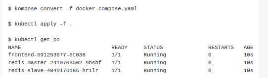
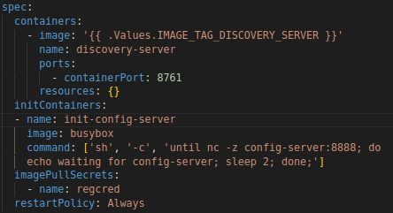
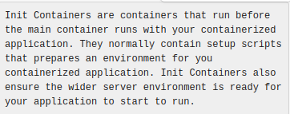
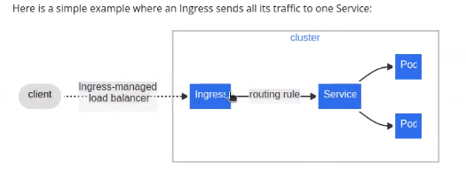
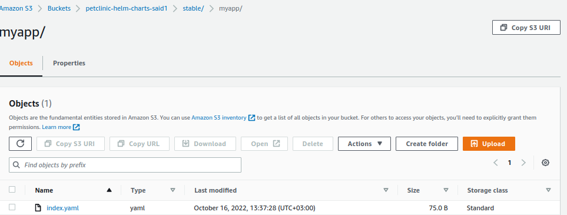
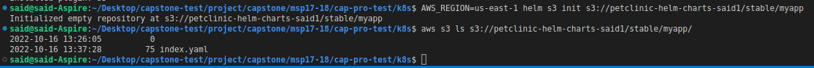
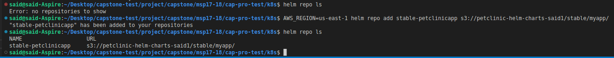
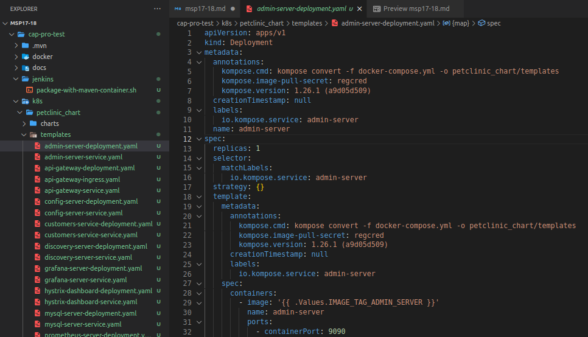

# # # # # # # # # # # # # # # # # # # # # # # # # # # # # # #
## MSP 17 - Prepare Petlinic Kubernetes YAML Files
# # # # # # # # # # # # # # # # # # # # # # # # # # # # # # #

* Create a folder with name of `k8s` under `petclinic-microservices-with-db` folder for keeping the manifest files of Petclinic App on Kubernetes cluster.

* Create a `docker-compose.yml` under `k8s` folder with the following content as to be used in conversion the k8s files.

```yaml
version: '3'
services:
  config-server:
    image: "{{ .Values.IMAGE_TAG_CONFIG_SERVER }}"
    ports:
     - 8888:8888
    labels:
      kompose.image-pull-secret: "regcred"
  discovery-server:
    image: "{{ .Values.IMAGE_TAG_DISCOVERY_SERVER }}"
    ports:
     - 8761:8761
    labels:
      kompose.image-pull-secret: "regcred"
  customers-service:
    image: "{{ .Values.IMAGE_TAG_CUSTOMERS_SERVICE }}"
    deploy:
      replicas: 2
    ports:
    - 8081:8081
    labels:
      kompose.image-pull-secret: "regcred"
  visits-service:
    image: "{{ .Values.IMAGE_TAG_VISITS_SERVICE }}"
    deploy:
      replicas: 2
    ports:
     - 8082:8082
    labels:
      kompose.image-pull-secret: "regcred"
  vets-service:
    image: "{{ .Values.IMAGE_TAG_VETS_SERVICE }}"
    deploy:
      replicas: 2
    ports:
     - 8083:8083
    labels:
      kompose.image-pull-secret: "regcred"
  api-gateway:
    image: "{{ .Values.IMAGE_TAG_API_GATEWAY }}"
    deploy:
      replicas: 1
    ports:
     - 8080:8080
    labels:
      kompose.image-pull-secret: "regcred"
      kompose.service.expose: "{{ .Values.DNS_NAME }}"
      kompose.service.type: "nodeport"
      kompose.service.nodeport.port: "30001"
  tracing-server:
    image: openzipkin/zipkin
    environment:
    - JAVA_OPTS=-XX:+UnlockExperimentalVMOptions -Djava.security.egd=file:/dev/./urandom
    ports:
     - 9411:9411
  admin-server:
    image: "{{ .Values.IMAGE_TAG_ADMIN_SERVER }}"
    ports:
     - 9090:9090
    labels:
      kompose.image-pull-secret: "regcred"
  hystrix-dashboard:
    image: "{{ .Values.IMAGE_TAG_HYSTRIX_DASHBOARD }}"
    ports:
     - 7979:7979
    labels:
      kompose.image-pull-secret: "regcred"
  grafana-server:
    image: "{{ .Values.IMAGE_TAG_GRAFANA_SERVICE }}"
    ports:
    - 3000:3000
    labels:
      kompose.image-pull-secret: "regcred"
  prometheus-server:
    image: "{{ .Values.IMAGE_TAG_PROMETHEUS_SERVICE }}"
    ports:
    - 9091:9090
    labels:
      kompose.image-pull-secret: "regcred"

  mysql-server:
    image: mysql:5.7.8
    environment: 
      MYSQL_ROOT_PASSWORD: petclinic
      MYSQL_DATABASE: petclinic
    ports:
    - 3306:3306
```
- Bu docker-compose.yml dosyasını kubernetesin masnifesto dosyasına çeviren kompose toolu var.
- https://kompose.io/ sayfasından dökümantasyon sayfasına ulaşabilirsin.

* Install [conversion tool](https://kompose.io/installation/) named `Kompose` on your Jenkins Server. [User Guide](https://kompose.io/user-guide/#user-guide)

```bash
curl -L https://github.com/kubernetes/kompose/releases/download/v1.26.1/kompose-linux-amd64 -o kompose
chmod +x kompose
sudo mv ./kompose /usr/local/bin/kompose
kompose version
```

- Helm chartları bulduğumuz yer https://artifacthub.io/ sayfasından ulaşabilirsin.

* Install Helm [version 3+](https://github.com/helm/helm/releases) on Jenkins Server. [Introduction to Helm](https://helm.sh/docs/intro/). [Helm Installation](https://helm.sh/docs/intro/install/).

```bash
curl https://raw.githubusercontent.com/helm/helm/master/scripts/get-helm-3 | bash
helm version
```
* Create an helm chart named `petclinic_chart` under `k8s` folder.

```bash
cd k8s
helm create petclinic_chart
```

* Remove all files under the petclinic_chart/templates folder.

```bash
rm -r petclinic_chart/templates/*
```
- Kendi hazırladığımız file ları yükleyeceğiz bundan dolayı default gelen dosyaları sildik.


  
* Convert the `docker-compose.yml` into k8s/petclinic_chart/templates objects and save under `k8s/petclinic_chart` folder.

```bash
kompose convert -f docker-compose.yml -o petclinic_chart/templates
```
- Microservice mimarisini hazırladığımız  docker-compose.yml dosyasını `kompose convert` komutu ile dosyalarımızı dönüştürüp `-o petclinic_chart/templates` petclinic_chart içindeki templates klasörünün içine atmasını söylüyoruz.

- Docker compose da hangi service in önce kaltıktan sonra diğerlerinin kalkmasını `depends_on` ile bunu halletmiştik. Kubernetes de bu bize yardım etmiyor bunu yerine `init container` var. Ana servis kalmadan kendinden önce kalkması gereken servislerin kalkıp kalmadığını kontrol eden yapıdır.

* Update deployment files with `init-containers` to launch microservices in sequence. See [Init Containers](https://kubernetes.io/docs/concepts/workloads/pods/init-containers/).

```yaml
# for discovery server
      initContainers:
      - name: init-config-server
        image: busybox
        command: ['sh', '-c', 'until nc -z config-server:8888; do echo waiting for config-server; sleep 2; done;']
```
- Bu komut satırını `discovery-server-deployment.yaml` dosyasını içine `containers` altına ve aynı hizada olacak şekilde yapıştır.





```yaml
# for all other microservices except config-server, discovery-server and mysql-server
      initContainers:
      - name: init-discovery-server
        image: busybox
        command: ['sh', '-c', 'until nc -z discovery-server:8761; do echo waiting for discovery-server; sleep 2; done;']
```  
- Bu komut satırını `config-server, discovery-server ve mysql-server` deployment haricindeki diğer `...-deployment.yaml` dosyalarına `containers` altına aynı hizaya yapıştırılacak.

- `until nc -z config-server:8888` burada `nc` cnfig-server in 8888 portunun yanıt verip vermediğini kontrol ediyor. 
- `until nc -z config-server:8888; do echo waiting for config-server; sleep 2; done;` komutunun özeti config-serverin 8888 portundan yayın yapana kadar bak gelmiyorsa 2 sn uyu tekrar bak.

- Kubernetes objemizi dünyaya açmak için `nodeport veya ingress objesi` ile açabiliriz. Bunun için 

    * Update `spec.rules.host` field of `api-gateway-ingress.yaml` file and add `ingressClassName: nginx` field under the `spec` field as below.

    ```yaml
    spec:
      ingressClassName: nginx
      rules:
        - host: '{{ .Values.DNS_NAME }}'
          ...
    ```
    - cap-pro-test/k8s/petclinic_chart/templates/api-gateway-ingress.yaml  


- * Add `k8s/petclinic_chart/values-template.yaml` file as below.

```yaml
IMAGE_TAG_CONFIG_SERVER: "${IMAGE_TAG_CONFIG_SERVER}"
IMAGE_TAG_DISCOVERY_SERVER: "${IMAGE_TAG_DISCOVERY_SERVER}"
IMAGE_TAG_CUSTOMERS_SERVICE: "${IMAGE_TAG_CUSTOMERS_SERVICE}"
IMAGE_TAG_VISITS_SERVICE: "${IMAGE_TAG_VISITS_SERVICE}"
IMAGE_TAG_VETS_SERVICE: "${IMAGE_TAG_VETS_SERVICE}"
IMAGE_TAG_API_GATEWAY: "${IMAGE_TAG_API_GATEWAY}"
IMAGE_TAG_ADMIN_SERVER: "${IMAGE_TAG_ADMIN_SERVER}"
IMAGE_TAG_HYSTRIX_DASHBOARD: "${IMAGE_TAG_HYSTRIX_DASHBOARD}"
IMAGE_TAG_GRAFANA_SERVICE: "${IMAGE_TAG_GRAFANA_SERVICE}"
IMAGE_TAG_PROMETHEUS_SERVICE: "${IMAGE_TAG_PROMETHEUS_SERVICE}"
DNS_NAME: "DNS Name of your application"
```
    - Bunu chartı dinamik yapamak için yaptık. Her kapatıp açtığımızda bunlar değişeceği için dinamik yapıp dosyaların içine girip değişiklik yapmaya gerek yok.

### Set up a Helm v3 chart repository in Amazon S3

* This pattern helps you to manage Helm v3 charts efficiently by integrating the Helm v3 repository into Amazon Simple Storage Service (Amazon S3) on the Amazon Web Services (AWS) Cloud. (https://docs.aws.amazon.com/prescriptive-guidance/latest/patterns/set-up-a-helm-v3-chart-repository-in-amazon-s3.html)

- S3 bucketi helm repository olarak kullanacağız. k8s/petclinic_chart altındaki charts ve templates leri paketleyip S3 ye göndereeceğiz. Aşağıdaki komutları kullanarak local makinede bile s3 bucketi oluşturabilirsin.

* Create an ``S3 bucket`` for Helm charts. In the bucket, create a ``folder`` called ``stable/myapp``. The example in this pattern uses s3://petclinic-helm-charts-<put-your-name>/stable/myapp as the target chart repository.

```bash
aws s3api create-bucket --bucket petclinic-helm-charts-<put-your-name> --region us-east-1
aws s3api put-object --bucket petclinic-helm-charts-<put-your-name> --key stable/myapp/
```

* Install the helm-s3 plugin for Amazon S3.

```bash
helm plugin install https://github.com/hypnoglow/helm-s3.git
```

* On some systems we need to install ``Helm S3 plugin`` as Jenkins user to be able to use S3 with pipeline script.

- Aşağıdaki komut satırlarını pipeline kullanarak işlemleri yapacağım için ve S3 ile konuşacak olan Jenkins-server olacağı için JEnkins-servera geçip `helm plugin` yüklemem gerekir.

``` bash
sudo su -s /bin/bash jenkins
export PATH=$PATH:/usr/local/bin
helm version
helm plugin install https://github.com/hypnoglow/helm-s3.git
```
* ``Initialize`` the Amazon S3 Helm repository.

```bash
AWS_REGION=us-east-1 helm s3 init s3://petclinic-helm-charts-<put-your-name>/stable/myapp 
```
- Yukarıdaki işlemi yaptıktan sonra s3 bucket daki myapp içinde `index.yaml` dosyası oluşacak bu dosya chart ile ilgili bilgiler ve version bilgileri olacak.



* The command creates an ``index.yaml`` file in the target to track all the chart information that is stored at that location.

* Verify that the ``index.yaml`` file was created.

```bash
aws s3 ls s3://petclinic-helm-charts-<put-your-name>/stable/myapp/
```
  - Bu komut ile cli da dosyanın oluşup oluşmadığını göreceğiz.



* Add the Amazon S3 repository to Helm on the client machine. 

```bash
helm repo ls
AWS_REGION=us-east-1 helm repo add stable-petclinicapp s3://petclinic-helm-charts-<put-your-name>/stable/myapp/
```
  - Local de helm repo da ne var bakıyoruz. Sonra helm repo olarak kullanacağımız s3 yi helm repoya ekliyoruz.

  

* Update `version` and `appVersion` field of `k8s/petclinic_chart/Chart.yaml` file as below for testing.

```yaml
version: 0.0.1
appVersion: 0.1.0
```

* ``Package`` the local Helm chart.

```bash
cd k8s
helm package petclinic_chart/ 
```
  - helm package işlemi ile paketliyoruz ve bit `.tgz` paketi oluşuyor.

* Store the local package in the Amazon S3 Helm repository.

```bash
HELM_S3_MODE=3 AWS_REGION=us-east-1 helm s3 push ./petclinic_chart-0.0.1.tgz stable-petclinicapp
```
  - Burada oluşan `petclinic_chart-0.0.1.tgz` dosyasını oluşturduğumuz S3 bucket içine gönderiyoruz.

* Search for the Helm chart.

```bash
helm search repo stable-petclinicapp
```

* You get an output as below.

```bash
NAME                                    CHART VERSION   APP VERSION     DESCRIPTION                
stable-petclinicapp/petclinic_chart     0.0.1           0.1.0           A Helm chart for Kubernetes
```
* In ``Chart.yaml``, ``set`` the `version` value to `0.0.2` in Chart.yaml, and then package the chart, this time changing the version in Chart.yaml to 0.0.2. Version control is ideally achieved through automation by using tools like GitVersion or Jenkins build numbers in a CI/CD pipeline. 

```bash
helm package petclinic_chart/
```

* Push the new version to the Helm repository in Amazon S3.

```bash
HELM_S3_MODE=3 AWS_REGION=us-east-1 helm s3 push ./petclinic_chart-0.0.2.tgz stable-petclinicapp
```

* Verify the updated Helm chart.

```bash
helm repo update
helm search repo stable-petclinicapp
helm search repo stable-petclinicapp -l
```

* You get an ``output`` as below.

```bash
NAME                                    CHART VERSION   APP VERSION     DESCRIPTION                
stable-petclinicapp/petclinic_chart     0.0.2           0.1.0           A Helm chart for Kubernetes
```

* To view all the available versions of a chart execute following command.

```bash
helm search repo stable-petclinicapp --versions
```

* Output:

```bash
NAME                                    CHART VERSION   APP VERSION     DESCRIPTION                
stable-petclinicapp/petclinic_chart     0.0.2           0.1.0           A Helm chart for Kubernetes
stable-petclinicapp/petclinic_chart     0.0.1           0.1.0           A Helm chart for Kubernetes
```

* In ``Chart.yaml``, ``set`` the `version` value to `HELM_VERSION` in Chart.yaml for automation in jenkins pipeline.

  - `HELM_VERSION` dinamik olsun diye yaptık sürekli chart.yaml gidip değiştirmek yerine otomatik değiştirsin 

# # # # # # # # # # # # # # # # # # # # # # # # # # # # # # #
## MSP 18 - Prepare a QA Automation Pipeline for Nightly Builds
# # # # # # # # # # # # # # # # # # # # # # # # # # # # # # #

- Prepare a script to ``package`` the app with maven Docker container and save it as `package-with-maven-container.sh` and save it under `jenkins` folder.

```bash
docker run --rm -v $HOME/.m2:/root/.m2 -v $WORKSPACE:/app -w /app maven:3.6-openjdk-11 mvn clean package
```
  - `-v $HOME/.m2:/root/.m2` volume olarak HOME altındaki `.m2` klasörünü `root` altındaki `.m2` klasörüne bağla
  - `-v $WORKSPACE:/app` şuan çalışmış olduğum workspace den docker içindeki `app` bağlanır
  - `-w /app` çalışılacak directory olarak `/app` gösterilir.
  - `maven:3.6-openjdk-11 mvn clean package` komutu ise .jar file üretir.

- Prepare a script to create ``ECR tags`` for the dev docker images and save it as `prepare-tags-ecr-for-dev-docker-images.sh` and save it under `jenkins` folder.

```bash
MVN_VERSION=$(. ${WORKSPACE}/spring-petclinic-admin-server/target/maven-archiver/pom.properties && echo $version)
export IMAGE_TAG_ADMIN_SERVER="${ECR_REGISTRY}/${APP_REPO_NAME}:admin-server-v${MVN_VERSION}-b${BUILD_NUMBER}"
MVN_VERSION=$(. ${WORKSPACE}/spring-petclinic-api-gateway/target/maven-archiver/pom.properties && echo $version)
export IMAGE_TAG_API_GATEWAY="${ECR_REGISTRY}/${APP_REPO_NAME}:api-gateway-v${MVN_VERSION}-b${BUILD_NUMBER}"
MVN_VERSION=$(. ${WORKSPACE}/spring-petclinic-config-server/target/maven-archiver/pom.properties && echo $version)
export IMAGE_TAG_CONFIG_SERVER="${ECR_REGISTRY}/${APP_REPO_NAME}:config-server-v${MVN_VERSION}-b${BUILD_NUMBER}"
MVN_VERSION=$(. ${WORKSPACE}/spring-petclinic-customers-service/target/maven-archiver/pom.properties && echo $version)
export IMAGE_TAG_CUSTOMERS_SERVICE="${ECR_REGISTRY}/${APP_REPO_NAME}:customers-service-v${MVN_VERSION}-b${BUILD_NUMBER}"
MVN_VERSION=$(. ${WORKSPACE}/spring-petclinic-discovery-server/target/maven-archiver/pom.properties && echo $version)
export IMAGE_TAG_DISCOVERY_SERVER="${ECR_REGISTRY}/${APP_REPO_NAME}:discovery-server-v${MVN_VERSION}-b${BUILD_NUMBER}"
MVN_VERSION=$(. ${WORKSPACE}/spring-petclinic-hystrix-dashboard/target/maven-archiver/pom.properties && echo $version)
export IMAGE_TAG_HYSTRIX_DASHBOARD="${ECR_REGISTRY}/${APP_REPO_NAME}:hystrix-dashboard-v${MVN_VERSION}-b${BUILD_NUMBER}"
MVN_VERSION=$(. ${WORKSPACE}/spring-petclinic-vets-service/target/maven-archiver/pom.properties && echo $version)
export IMAGE_TAG_VETS_SERVICE="${ECR_REGISTRY}/${APP_REPO_NAME}:vets-service-v${MVN_VERSION}-b${BUILD_NUMBER}"
MVN_VERSION=$(. ${WORKSPACE}/spring-petclinic-visits-service/target/maven-archiver/pom.properties && echo $version)
export IMAGE_TAG_VISITS_SERVICE="${ECR_REGISTRY}/${APP_REPO_NAME}:visits-service-v${MVN_VERSION}-b${BUILD_NUMBER}"
export IMAGE_TAG_GRAFANA_SERVICE="${ECR_REGISTRY}/${APP_REPO_NAME}:grafana-service"
export IMAGE_TAG_PROMETHEUS_SERVICE="${ECR_REGISTRY}/${APP_REPO_NAME}:prometheus-service"
```
```bash
MVN_VERSION=$(. ${WORKSPACE}/spring-petclinic-admin-server/target/maven-archiver/pom.properties && echo $version)
```
  - `WORKSPACE` olarak `spring-petclinic-admin-server` directory sinin altında `mvn clean package` komutu çalıştıktan sonra `target` klasörü ve bunun altında `maven-archiver/pom.properties` oluşur. Sonra `pom.properties` den `echo $version` ile maven versionunu çeker(yazdırır).
  - Admin-server için tag hazırlanır `IMAGE_TAG_ADMIN_SERVER`. 

  

  - `${ECR_REGISTRY}` ve `${APP_REPO_NAME}` değişken olarak atıyacağız
  - Yukarıda oluşan `${MVN_VERSION}` ve jenkinsdeki `buil now` çalıştıkça `${BUILD_NUMBER}` değişken olarak atayacak
  - `export` set the export attribute for variables. 

- Prepare a script to build the dev docker images tagged for ECR registry and save it as `build-dev-docker-images-for-ecr.sh` and save it under `jenkins` folder.

```bash
docker build --force-rm -t "${IMAGE_TAG_ADMIN_SERVER}" "${WORKSPACE}/spring-petclinic-admin-server"
docker build --force-rm -t "${IMAGE_TAG_API_GATEWAY}" "${WORKSPACE}/spring-petclinic-api-gateway"
docker build --force-rm -t "${IMAGE_TAG_CONFIG_SERVER}" "${WORKSPACE}/spring-petclinic-config-server"
docker build --force-rm -t "${IMAGE_TAG_CUSTOMERS_SERVICE}" "${WORKSPACE}/spring-petclinic-customers-service"
docker build --force-rm -t "${IMAGE_TAG_DISCOVERY_SERVER}" "${WORKSPACE}/spring-petclinic-discovery-server"
docker build --force-rm -t "${IMAGE_TAG_HYSTRIX_DASHBOARD}" "${WORKSPACE}/spring-petclinic-hystrix-dashboard"
docker build --force-rm -t "${IMAGE_TAG_VETS_SERVICE}" "${WORKSPACE}/spring-petclinic-vets-service"
docker build --force-rm -t "${IMAGE_TAG_VISITS_SERVICE}" "${WORKSPACE}/spring-petclinic-visits-service"
docker build --force-rm -t "${IMAGE_TAG_GRAFANA_SERVICE}" "${WORKSPACE}/docker/grafana"
docker build --force-rm -t "${IMAGE_TAG_PROMETHEUS_SERVICE}" "${WORKSPACE}/docker/prometheus"
```
  - `-t "${IMAGE_TAG_ADMIN_SERVER}"` tag olarak bunu kullanacak.
  - `"${WORKSPACE}/spring-petclinic-admin-server"` docker build komutu çalıştığında `Dockerfile` arıyor. Bunun bulunduğu `WORKSPACE` i tanımlıyoruz.

  

- Prepare a script to push the dev docker images to the ECR repo and save it as `push-dev-docker-images-to-ecr.sh` and save it under `jenkins` folder.

```bash
# Provide credentials for Docker to login the AWS ECR and push the images
aws ecr get-login-password --region ${AWS_REGION} | docker login --username AWS --password-stdin ${ECR_REGISTRY} 
docker push "${IMAGE_TAG_ADMIN_SERVER}"
docker push "${IMAGE_TAG_API_GATEWAY}"
docker push "${IMAGE_TAG_CONFIG_SERVER}"
docker push "${IMAGE_TAG_CUSTOMERS_SERVICE}"
docker push "${IMAGE_TAG_DISCOVERY_SERVER}"
docker push "${IMAGE_TAG_HYSTRIX_DASHBOARD}"
docker push "${IMAGE_TAG_VETS_SERVICE}"
docker push "${IMAGE_TAG_VISITS_SERVICE}"
docker push "${IMAGE_TAG_GRAFANA_SERVICE}"
docker push "${IMAGE_TAG_PROMETHEUS_SERVICE}"
```
  - `aws ecr get-login-password --region ${AWS_REGION}` ECR a login olunur ve `docker login --username AWS --password-stdin ${ECR_REGISTRY}` bize credentials veriyor.

